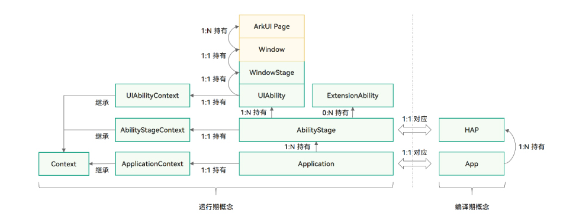
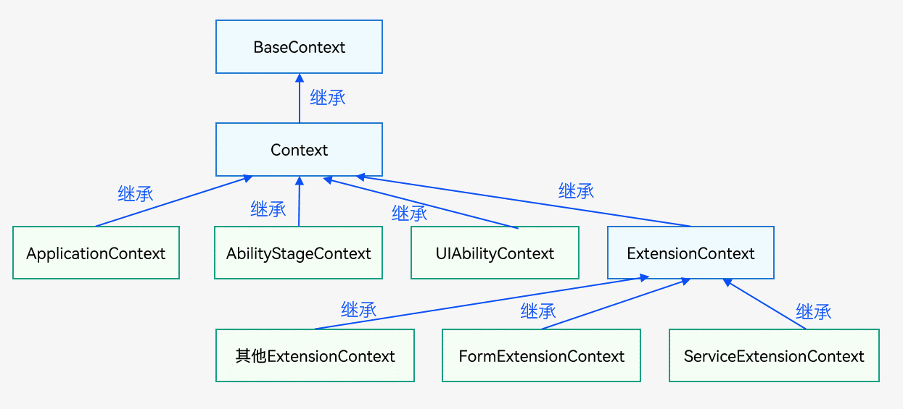
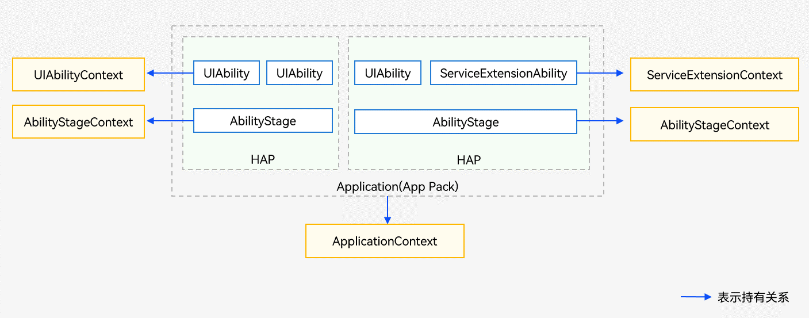
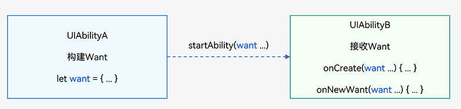

## Stage 模型

Stage 模型是 HarmonyOS NEXT 版本主推且会长期演进的模型，该模型提供了 AbilityStage、WindowStage 等类作为应用组件和 Window 窗口的“舞台”，因此称这种应用模型为 Stage 模型。
Stage 模型中，多个应用组件共享同一个 ArkTS 引擎实例，在 Stage 模型中，应用组件之间可以方便的共享对象和状态，同时减少复杂应用运行对内存的占用

1. 模型的基本概念
   

2. 应用组件

   1. AbilityStage
      - 是一个 Module 级别的组件容器，应用的 HAP 在首次加载时会创建一个 AbilityStage 实例，可以对该 Module 进行初始化等操作
      - AbilityStage 与 Module 一一对应，即一个 Module 拥有一个 AbilityStage
      - 默认工程中未自动生成 AbililtyStage，需要手动新建一个 AbilityStage 文件
      - 生命周期和事件回调
        - `onCreate()`：在开始加载对应 Module 的第一个 UIAbility 实例之前会先创建 AbilityStage，并在 AbilityStage 创建完成之后执行 onCreate 生命周期回调
        - `onAccepteWant(want: Want)`：UIAbility 指定实例模式（specified）启动时触发的事件回调
        - `onConfigurationUpdated(config: Configuration)`：当系统全局配置发生变更时触发的事件，如系统语言、深浅色等，配置项目目前在 Configuration 类中
        - `onMemoryLevel(level: AbilityConstant.MemoryLevel)`：当系统调整内容时触发的事件
   2. UIAbility 组件

      - 是一种包含 UI 的应用组件，主要用于和用户交互
      - UIAbility 的生命周期只包含创建/销毁/前台/后台等状态，与显示相关的状态通过 WindowStage 事件
      - 可以根据具体场景选择单个还是多个 UIAbility
        - 如果希望在任务视图中看到一个任务，则建议使用一个 UIAbility，多个页面的方式
        - 如果希望在任务视图中看到多个任务，或者需要同时开启多个窗口，则建议使用多个 UIAbility 开发不同的模块功能。
      - 组件生命周期（参照生命周期.md）
      - 组件启动模式

        - singleton（单实例模式），默认模式
          - 在 feature 中`module.json5`配置
            ```
              {
                "abilities": [
                  {
                    "launchType": "singleton",
                  }
                ]
              }
            ```
          - 每次调用 `startAbility()` 方法时，如果应用进程中该类型的 UIAbility 实例已经存在，则复用系统中的 UIAbility 实例
        - multiton（多实例模式）
          - 在 feature 中`module.json5`配置
            ```
              {
                "abilities": [
                  {
                    "launchType": "multiton",
                  }
                ]
              }
            ```
          - 每次调用`startAbility()`方法时，都会在应用进程中创建一个新的该类型 UIAbility 实例
        - specified（指定实例模式）
          - 在 feature 中`module.json5`配置
            ```
              {
                "abilities": [
                  {
                    "launchType": "specified",
                  }
                ]
              }
            ```
          - 针对一些特殊场景使用（例如文档应用中每次新建文档希望都能新建一个文档实例，重复打开一个已保存的文档希望打开的都是同一个文档实例）

      - 基本用法
        - 指定 UIAbility 的启动页面：在`onWindowStageCreate()`回调中，通过 WindowStage 的`loadContent()`方法设置加载页面
        - 获取 UIAbility 的上下文信息
          - 在 UIAbility 中，可以通过`this.context`方法获取 UIAbility 上下文信息
          - 在页面中获取 UIAbility 实例的上下文信息，通过`getContext()`获取
      - 数据同步

        - EventHub，在基类 Context 中提供了 EventHub 对象，可以通过发布订阅的方式来实现事件的传递

          - 在 UIAbility 中调用`eventHub.on()`

            ```
              export class EntryAbility extends UIAbility {

                eventFunc(data){
                  <!-- 触发事件 -->
                }

                onCreate() {
                  let eventHub = this.context.eventHub;
                  eventHub.on('event1', this.eventFunc);
                }

                onDestroy() {
                  let eventHub = this.context.eventHub;
                  eventHub.off('event1', this.eventFunc);
                }
              }
            ```

          - 在 UI 中通过`eventHub.emit()`方法触发该事件，触发事件的同时，根据需要传入参数信息
            ```
              @Entry
              @Component
              struct Index {
                aboutToApper() {
                  let context = getContext(this);
                  contex.eventHub.emit('event1', 1)
                }
                build() {}
              }
            ```

        - AppStorage/LocalStorage，应用级别的状态管理方案
          - AppStorage：全局的状态管理器，适用于多个 UIAbility 共享同一状态数据的情况
          - LocalStorage：局部的状态管理器，适用于单个 UIAbility 内部的状态数据

      - 启动应用内的 UIAbility 组件

        - 启动应用内容的 UIAbility
          - 在 EntryAbility 中`startAbility(want: Want)`
            ```
              let wantInfo: Want = {
                deviceId: '', // deviceId为空表示本设备
                bundleName: 'com.samples.stagemodelabilitydevelop',
                moduleName: 'entry', // 同一模块内使用当前模块名，否则使用对应HAP的模块名
                abilityName: 'FuncAbilityA',
                parameters: {
                  // 自定义信息
                  info: '来自EntryAbility Page_UIAbilityComponentsInteractive页面'
                },
              };
              // context为调用方UIAbility的UIAbilityContext
              this.context.startAbility(wantInfo).then(() => {
                hilog.info(DOMAIN_NUMBER, TAG, 'startAbility success.');
              }).catch((error: BusinessError) => {
                hilog.error(DOMAIN_NUMBER, TAG, 'startAbility failed.');
              });
            ```
          - 在 FuncAbility 的`onCreate()`或者`onNewWant()`生命周期中接收 EntryAbility 传递过来的参数
            ```
              onCreate(want: Want, launchParam: AbilityConstant.LaunchParam) {
                let funcAbilityWant = want;
                let info = funcAbilityWant?.parameters?.info;
              }
            ```
          - 在 FuncAbility 业务完成之后，通过`terminateSelf()`方法停止该 UIAbility 实例，默认会保留该实例的快照，即在最近任务列表中仍能查看该实例对应的任务。如不需要保留该实例的快照，可以在对应 UIAbility 的`module.json5`配置中，将 abilities 标签的 removeMissionAfterTerminate 字段设置为 true
          - 关闭所有的 UIAbility 实例，通过调用 ApplicationContext 的`killAllProcesses()`方法关闭应用所有的进程
        - 启动应用内的 UIAbility 并获取返回结果

          - 在 EntryAbility 中`startAbilityForResult(want: Want)`
            ```
              let context: common.UIAbilityContext = getContext(this) as common.UIAbilityContext; // UIAbilityContext
              const RESULT_CODE: number = 1001;
              let want: Want = {
                deviceId: '', // deviceId为空表示本设备
                bundleName: 'com.samples.stagemodelabilitydevelop',
                moduleName: 'entry', // moduleName非必选
                abilityName: 'FuncAbilityA',
                parameters: {
                  // 自定义信息
                  info: '来自EntryAbility UIAbilityComponentsInteractive页面'
                }
              };
              context.startAbilityForResult(want).then((data) => {
                if (data?.resultCode === RESULT_CODE) {
                  // 解析被调用方UIAbility返回的信息
                  let info = data.want?.parameters?.info;
                  hilog.info(DOMAIN_NUMBER, TAG, JSON.stringify(info) ?? '');
                  if (info !== null) {
                    promptAction.showToast({
                      message: JSON.stringify(info)
                    });
                  }
                }
              })
            ```
          - 在 FuncAbility 停止自身时，需要调用`terminateSelfWithResult(result: common.AbilityResult)`方法，并携带返回结果
            ```
              let context: common.UIAbilityContext = getContext(this) as common.UIAbilityContext; // UIAbilityContext
              const RESULT_CODE: number = 1001;
              let abilityResult: common.AbilityResult = {
                resultCode: RESULT_CODE,
                want: {
                  bundleName: 'com.samples.stagemodelabilitydevelop',
                  moduleName: 'entry', // moduleName非必选
                  abilityName: 'FuncAbilityB',
                  parameters: {
                    info: '来自FuncAbility Index页面'
                  },
                },
              };
              context.terminateSelfWithResult(abilityResult, (err) => {
                if (err.code) {
                  hilog.error(DOMAIN_NUMBER, TAG, `Failed to terminate self with result. Code is ${err.code}, message is ${err.message}`);
                  return;
                }
              });
            ```

        - 启动 UIAbility 的指定页面
          - UIAbility 启动分为两种情况：冷启动、热启动
            - 冷启动：UIAbility 实例处于完全关闭状态下被启动，这需要完整的加载和初始化 UIAbility 实例的代码、资源等
            - 热启动：UIAbility 实例已经启动饼子啊前台运行过，由于某些原因切换到后台，再次启动改 UIAbility 实例，这种情况可以快速恢复到 UIAbility 实例的状态
          - 调用方 UIAbility 指定启动页面：通过 want 中的 parameters 参数增加一个自定义参数传递页面跳转信息
            ```
              let want: Want = {
                deviceId: '',
                bundleName: 'com.samples.stagemodelabilitydevelop',
                abilityName: 'FuncAbilityA',
                moduleName: 'entry',
                parameters: {
                  router: "funcA"
                }
              }
              context.startAbility(want);
            ```
          - 目标 UIAbility 冷启动，在`onCreate()`生命周期中，接收调用方传来的参数，然后在`onWindowStageCreate()`生命周期中，解析传递参数，根据参数加载指定的页面信息 url
            ```
              class FuncAbilityA extends UIAbility {
                funcAbilityWant?: Want
                onCreate(want: Want){
                  this.funcAbilityWant = want
                }
                onWindowStageCreate(windowStage: WindowStage) {
                  let url = 'pages/Index';
                  if (this.funcAbilityWant?.parameters?.router && this.funcAbilityWant.parameters.router === 'funcA') {
                    url = 'pages/Page_ColdStartUp';
                  }
                  windowStage.loadContent(url, (err, data) => {})
                }
              }
            ```
          - 目标 UIAbility 热启动，不会重新走初始逻辑，只会直接触发`onNewWant()`生命周期方法
            - 冷启动应用 UIAbility 实例时，在`onWindowStageCreate()`生命周期回调中，通过调用`getUIContext()`接口缓存 UIContext 对象
              ```
                class FuncAbilityA extends UIAbility {
                  uiContext?: UIContext;
                  onWindowStageCreate(windowStage: WindowStage) {
                    windowStage.loadContent(url, (err, data) => {
                      if(err.code){
                        return
                      }
                      windowStage.getMainWindow((err, data) =>{
                        if(err.code){
                          return
                        }
                        this.uiContext = data.getUIContext();
                      })
                    })
                  }
                }
              ```
            - 在 UIAbility 的`onNewWant()`生命周期中，解析 want 参数，通过调用 UIContext 中的`getRouter()`方法获取 Router 对象，并进行指定页面的跳转
              ```
                onNewWant(want: Want) {
                  if (want?.parameters?.router && want.parameters.router === 'funcA') {
                    let funcAUrl = 'pages/Page_HotStartUp';
                    if (this.uiContext) {
                      let router: Router = this.uiContext.getRouter();
                      router.pushUrl({
                        url: funcAUrl
                      }).catch((err: BusinessError) => {
                        hilog.error(DOMAIN_NUMBER, TAG, `Failed to push url. Code is ${err.code}, message is ${err.message}`);
                      });
                    }
                  }
                }
              ```
          - 当被调用方 UIAbility 组件启动模式设置为 multiton 启动模式时，每次启动都会创建一个新的实例，那么 `onNewWant()`回调就不会被用到。

   3. ExtensionAbility
      - 是一种面向特定场景的应用组件
      - 不直接从 ExtensionAbility 组件派生，而是需要使用 ExtensionAbility 组件的派生类
      - 场景：
        - 用于卡片场景的 FormExtensionAbility
        - 用于输入法场景的 InputMethodExtensionAbility
        - 用于闲时任务场景的 WorkSchedulerExtensionAbility 等多种派生类
      - 在 Stage 模型上，普通应用开发者不能开发自定义服务，而需要根据自身的业务场景通过 ExtensionAbility 的派生类来实现。
   4. WindowStage
      - 窗口管理器。管理各个基本窗口单元，即 Window 实例。
      - 每个 UIAbility 实例都会与一个 WindowStage 类实例绑定，该类起到了应用进程内窗口管理器的作用
      - 包含一个主窗口。也就是说 UIAbility 实例通过 WindowStage 持有了一个主窗口，该主窗口为 ArkUI 提供了绘制区域
   5. Context

      - 应用中对象的上下文，提供了应用的一些基础信息，例如 resourceManager（资源管理）、applicationInfo（当前应用信息）、dir（应用文件路径）、area（文件分区）等，以及应用的一些基本方法
      - 各类 Context 的继承关系
        
      - 各类 Context 的持有关系
        
      - 各类 Context 的获取方式
        - 获取 UIAbilityContext（操作应用组件，获取应用组件的配置信息等能力）
          ```
            export class UIAbility extends Ability {
              onCreate(want: Want){
                let uiContext = this.context;
              }
            }
          ```
        - 获取特定场景 ExtensionContext。
          ```
            export default class Service extends ServiceExtensionAbility {
              onCreate(want: Want){
                let serviceExtensionContext = this.context;
              }
            }
          ```
        - 获取 AbilityStageContext，Module 级别的 Context，和基类 Context 相比，额外提供 HapModuleInfo、Configuration 等信息
          ```
            export default class MyAbilityStage extends AbilityStage {
              onCreate(){
                let abilityStageContext = this.context;
              }
            }
          ```
        - 获取 ApplicationContext，应用级别的 Context。ApplicationContext 在基类 Context 的基础上提供了订阅应用内应用组件的生命周期的变化、订阅系统内存变化和订阅应用内系统环境的变化的能力，在 UIAbility、ExtensionAbility、AbilityStage 中均可以获取。
          ```
            export default class EntryAbility extends UIAbility {
              onCreate(want: Want, launchParam: AbilityContext.LaunchParam){
                let applicationContext = this.context.getApplicationContext();
              }
            }
          ```
      - 获取和修改加密分区
        - 应用文件加密是一种保护数据安全的方法，可以使得文件在未经授权访问的情况下得到保护
          - EL1：对于私有文件，如闹铃、壁纸等，应用可以将这些文件放到设备级加密分区（EL1）中，以保证在用户输入密码前就可以被访问
          - EL2：对于更敏感的文件，如个人隐私信息等，应用可以将这些文件放到更高级别的加密分区（EL2）中，以保证更高的安全性
          - EL3：对于应用中的记录步数、文件下载、音乐播放，需要在锁屏时读写和创建新文件，放在（EL3）的加密分区比较合适
          - EL4：对于用户安全信息相关的文件，锁屏时不需要读写文件、也不能创建文件，放在（EL4）的加密分区更合适。
        - 获取和设置当前加密分区，通过读写 Context 的 area 属性实现
          - 在 UIAbility 中修改
            ```
              import contextConstant from '@ohos.app.ability.contextConstant'
              export default class EntryAbility extends UIAbility {
                onCreate(want: Want, launchParam: AbilityContext.LaunchParam){
                  this.context.area = contextConstant.AreaMode.EL1;
                }
              }
            ```
          - 在 UIPage 中修改
            ```
              import contextConstant from '@ohos.app.ability.contextConstant'
              @Entry
              @Component
              struct Index {
                build() {
                  Column() {
                    Button("修改")
                    .onClick(() => {
                      const context = getContext(this)
                      context.area = contextConstant.AreaMode.EL1;
                    })
                  }
                }
              }
            ```
      - 获取本应用中其他 Module 的 Context

        - 调用`createModuleContext(moduleName: string)`方法，获取本应用中其他 Module 的 Context

        ```
          @Entry
          @Component
          struct Index {
            build() {
              Column() {
                Button("获取")
                .onClick(() => {
                  const context = getContext(this)
                  let moduleContext = context.createModuleContext('moduleA');
                })
              }
            }
          }
        ```

   6. 信息传递载体 Want
      - 定义
        - Want 是一种对象，用于在应用组件之间传递信息
        - 一种常见的使用场景是作为 `startAbility()`方法的参数
          
      - 类型
        - 显式 Want
          - 在启动目标应用组件时，调用方在 want 参数中指定了 abilityName 和 bundleName，称为显式 Want
          - 通常用于应用内组件启动，通过在 Want 对象内指定本应用 Bundle 名称信息（bundleName）和 abilityName 来启动应用内目标组件
            ```
              let want: Want = {
                deviceId: "",
                bundleName: "com.example.myapplication",
                abilityName: "FuncAbility",
              }
            ```
        - 隐式 Want
          - 在启动目标应用组件时，调用方传入的 want 参数中未指定 abilityName，称为隐式 Want
          - 当需要处理的对象不明确时，可以使用隐式 Want，在当前应用中使用其他应用提供的某个能力，而不关心提供该能力的具体应用。
          - 隐式 Want 使用 skills 标签来定义需要使用的能力，并由系统匹配声明支持该请求的所有应用来处理请求。
          ```
            let want: Want = {
              action: "ohos.want.action.search",
              entities: ["entity.system.browsable"],
              uri: "content://com.example.myapplication",
              type: "text/plain",
            }·
          ```
      - 匹配规则（https://developer.huawei.com/consumer/cn/doc/harmonyos-guides-V5/explicit-implicit-want-mappings-V5#uri%E5%8C%B9%E9%85%8D%E8%A7%84%E5%88%99）
