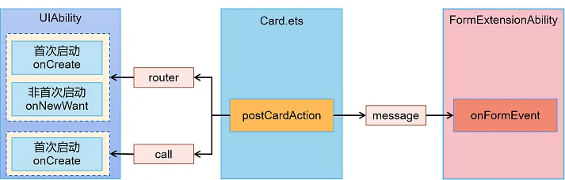
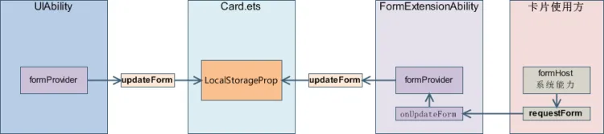

## 元服务和卡片

1. 元服务

   - 元服务是一种无需下载安装即可使用的轻量化服务形态。它以卡片的形式呈现，用户可以根据需求自由组合不同的元服务卡片，实现个性化定制
   - 场景
     - 常用服务卡片添加到桌面，体验快捷服务
     - 释放手机，让用户在更合适的设备上享受服务
   - 元服务必须要有服务卡片

2. 卡片

   - 卡片是一种界面展示形式，可以将应用的重要信息或操作前置到服务卡片（以下简称“卡片”），以达到服务直达、减少跳转层级的体验效果
   - 卡片常用于嵌入到其他应用（当前被嵌入方即卡片使用方只支持系统应用，例如桌面）中作为其界面显示的一部分，并支持拉起页面、发送消息等基础的交互能力
   - 概念
     - 使用方：显示卡片内容的宿主应用，控制卡片在宿主中展示的位置
       - 应用图标：应用入口图标，点击后可拉起应用进程，图标内容不支持交互
       - 卡片：具备不同规格大小的界面展示，卡片的内容可以进行交互，如实现按钮进行界面的刷新、应用的跳转等
     - 提供方：包含卡片的应用，提供卡片的显示内容、控件布局以及控件点击处理逻辑
       - FormExtensionAbility：卡片业务逻辑模块，提供卡片创建、销毁、刷新等生命周期回调
       - 卡片页面：卡片 UI 模块，包含页面控件、布局、事件等显示和交互信息
     - 相关 API
       - FormExtensionAbility：卡片扩展模块，提供卡片创建、销毁、刷新等生命周期回调
       - FormExtensionContext：FormExtensionAbility 的上下文环境，提供 FormExtensionAbility 具有的接口和能力
       - formProvider：提供卡片提供方相关的接口能力，可通过该模块提供接口实现更新卡片、设置卡片更新时间、获取卡片信息、请求发布卡片等
       - formInfo：提供了卡片信息和状态等相关类型和枚举
       - formBindingData：提供卡片数据绑定的能力，包括 FormBindingData 对象的创建、相关信息的描述
       - 页面布局（`WidgetCard.ets`）：提供声明式范式的 UI 接口能力
         - ArkTS 卡片特有能力：postCardAction 用于卡片内部和提供方应用间的交互，仅在卡片中可以调用
         - ArkTS 卡片能力列表：列举了能在 ArkTS 卡片中使用的 API、组件、事件、属性和生命周期调度
       - 卡片配置：包含 FormExtensionAbility 的配置和卡片的配置
         - 在 `module.json5` 配置文件中的 extensionAbilities 标签下，配置 FormExtensionAbility 相关信息
         - 在 `resources/base/profile/`目录下的 `form_config.json` 配置文件中，配置卡片（`WidgetCard.ets`）相关信息
   - 卡片生命周期
     - `onAddForm(want: Want): formBindingData.FormBindingData`：卡片提供方接收创建卡片的通知接口，需要返回卡片数据绑定类
     - `onCastToNormalForm(formId: string): void`：卡片提供方接收临时卡片转常态卡片的通知接口
     - `onUpdateForm(formId: string, wantParams?: Record<string, Object>): void`：卡片提供方接收携带参数的更新卡片的通知接口。获取最新数据后调用 formProvider 的 updateForm 接口刷新卡片数据
     - `onChangeFormVisibility(newStatus: Record<string, number>): void`：使用方发起可见或者不可见通知触发，提供方需要做响应的处理，仅系统应用时生效
     - `onFormEvent(formId: string, message: string): void`： 如果卡片支持触发事件，则需要重新写该方法并实现对事件的触发
     - `onRemoveForm(formId: string): void`：当删除卡片时触发，删除卡片实例数据，删除之前持久化的卡片实例数据
     - `onConfigurationUpdate(newConfig: Configuration): void`：当系统配置更新时调用，仅当前 formExtensionAbility 存活时更新配置才会触发此生命周期。需要注意：formExtensionAbility 创建后 10 秒内无操作将会被清理
     - `onAcquireFormState?(want: Want): formInfo.FormState`：卡片提供方接收查询卡片状态通知接口，默认返回卡片初始状态
     - `onStop(): void`：当卡片提供方的卡片进程退出时，触发该回调
   - 卡片动效能力
     - 静态卡片不支持使用动效能力
     - 限制
       |名称| 参数说明 |限制描述|
       |duration | 动画播放时长 |限制最长的动效播放时长为 1 秒，当设置大于 1 秒的时间时
       ，动效时长仍为 1 秒|
       |tempo |动画播放速度 |卡片中禁止设置此参数，使用默认值 1|
       |delay |动画延迟执行的时长 |卡片中禁止设置此参数，使用默认值 0|
       |iterations |动画播放次数 |卡片中禁止设置此参数，使用默认值 1|
   - 卡片事件

     - 动态卡片，提供 postCardAction 接口用于卡片内部和提供方应用间的交互，当前支持 router、message 和 call 三种类型的事件，仅在卡片中可以调用
       
     - 静态卡片，提供 FormLink 用于卡片内部和提供方应用间的交互
     - 场景

       - 使用 router 事件跳转到指定 UIAbility

         - 动态卡片
           - 卡片内容
             ```
               @Entry
               @Component
               struct WidgetCard {
                 build() {
                   Column() {
                     Button('按钮1').onClick(() => {
                       postCardAction({
                         action: 'router',
                         abilityName: "EntryAbility",
                         params: {targetPage: "pageOne"}
                       })
                     })
                     Button('按钮2').onClick(() => {
                       postCardAction({
                         action: 'router',
                         abilityName: "EntryAbility",
                         params: {targetPage: "pageTwo"}
                       })
                     })
                 }
               }
               }
             ```
           - EntryAbility
             ```
              export default class EntryAbility extends Ability {
                private selectPage: string = ""
                private windowStage: window.WindowStage | null = null
                onCreate(want: Want, launchParam: AbilityConstant.LaunchParam): void {
                  if(want.parameters?.params){
                    this.selectPage = JSON.parse(want.parameters?.params as string)["targetPage"]
                  }
                }
                onNewWant(want: Want, launchParam: AbilityConstant.LaunchParam): void {
                  if(want.parameters?.params){
                    this.selectPage = JSON.parse(want.parameters?.params as string)["targetPage"]
                  }
                  if(this.windowStage){
                    this.onWindowStageCreate(this.windowStage)
                  }
                }
                onWindowStageCreate(windowStage: window.WindowStage): void {
                  if(!this.windowStage){
                    this.windowStage = windowStage
                  }
                  let targetPage: string = "pages/Index"
                  if(this.selectPage){
                    targetPage = "pages/" + this.selectPage
                  }
                  windowStage.loadContent(targetPage, (err) => {})
                }
              }
             ```
         - 静态卡片

           ```
             @Entry
             @Component
             struct WidgetCard {
               build() {
                Column() {
                  FormLink({
                    action: "router",
                    abilityName: "EntryAbility",
                    params: {targetPage: "pageOne"}
                  }) {
                    Button("按钮1")
                  }

                }
               }
             }
           ```

       - 使用 call 事件拉起指定的 UIAbility 到后台

         - 提供方应用需要具备后台运行权限(`ohos.permission.KEEP_BACKGROUND_RUNNING`)
         - 动态卡片

           - 卡片内容
             ```
               @Entry
               @Component
               struct Widget1Card {
                 build() {
                   Column() {
                     Button("按钮1")
                       .onClick(() => {
                         postCardAction(this, {
                           action: "call",
                           abilityName: "EntryAbility",
                           params: {
                             action: "play",
                             method: "funA"
                           }
                         })
                       })
                     Button("按钮2")
                       .onClick(() => {
                         postCardAction(this, {
                           action: "call",
                           abilityName: "EntryAbility",
                           params: {
                             action: "pause",
                             method: "funB"
                           }
                         })
                       })
                   }
                   .height("100%")
                     .width("100%")
                     .alignItems(HorizontalAlign.Center)
                 }
               }
             ```
           - EntryAbility

             ```
                // 这个类用来在事件中返回该类的实例化对象处理的
                class MyParcelable implements rpc.Parcelable {
                  num: number;
                  str: string;

                  constructor(num: number, str: string) {
                    this.num = num;
                    this.str = str;
                  }

                  marshalling(dataOut: rpc.MessageSequence): boolean {
                    dataOut.writeInt(this.num);
                    dataOut.writeString(this.str);
                    return true;
                  }

                  unmarshalling(dataIn: rpc.MessageSequence): boolean {
                    this.num = dataIn.readInt();
                    this.str = dataIn.readString();
                    return true;
                  }
                }

               export default class EntryAbility extends UIAbility {
                 onCreate(want: Want, launchParam: AbilityConstant.LaunchParam): void {
                   hilog.info(0x0000, 'testTag', '%{public}s', 'Ability onCreate');
                   // console.log("xietian--onCreate", JSON.stringify(want.parameters))
                   // 接收funA的处理
                   this.callee.on("funA", (data: rpc.MessageSequence) => {
                     console.log("xietian--funA", JSON.parse(data.readString()).action)
                     return new MyParcelable(1, "aaa");
                   })
                   // 接收funB的处理
                   this.callee.on("funB", (data: rpc.MessageSequence) => {
                     console.log("xietian--funB", JSON.parse(data.readString()).action)

                     return new MyParcelable(2, "bbb");
                   })
                 }

               }
             ```

         - 静态卡片

           ```
             @Entry
             @Component
             struct WidgetCard {
               build(){
                  Column() {
                    FormLink({
                     action: "call",
                     abilityName: "EntryAbility",
                     params: {
                       action: "play",
                       method: "funA"
                     }
                   }) {
                     Button("播放")
                       .width(120)
                       .height(32)

                   }
                   FormLink({
                     action: "call",
                     abilityName: "EntryAbility",
                     params: {
                       action: "pause",
                       method: "funB"
                     }
                   }) {
                     Button("播放")
                       .width(120)
                       .height(32)
                   }
                  }
               }
             }
           ```

       - 使用 message 事件刷新卡片内容

         - 通过 postCardAction 接口触发 message 事件拉起 FormExtensionAbility，然后由 FormExtensionAbility 刷新卡片内容
         - 动态卡片

           - 卡片内容
             ```
                let storage = new LocalStorage()
                @Entry
                @Component
                struct WidgetCard {
                  @LocalStorageProp("title") title: string = "";
                  @LocalStorageProp("count") count: number = 0;
                  build() {
                    Column() {
                      Button("按钮1")
                      .onClick(() => {
                        postCardAction(this, {
                          action: "message",
                          params: {
                            type: "updateTitle"
                            title: "cde",
                            count: this.count,
                          }
                        })
                      })
                      Button("按钮2")
                        .onClick(() => {
                          postCardAction(this, {
                            action: "message",
                            params: {
                              type: "updateCount",
                              title: this.title,
                              count: this.count + 1
                            }
                          })
                        })
                      }
                  }
                }
             ```
           - FormExtensionAbility

             ```
              export default class EntryFormAbility extends FormExtensionAbility {
                onAddForm(want: Want) {
                  let formData: IData = {
                    title: "初始标题",
                    count: 1,
                  }
                  return formBindingData.createFormBindingData(formData);
                }
                onFormEvent(formId: string, message: string) {
                  let info: IData = JSON.parse(message)
                  let formData = formBindingData.createFormBindingData(info)
                  formProvider.updateForm(formId, formData)
                }
              }
             ```

         - 静态卡片
           ```
            let storage = new LocalStorage()
            @Entry(storage)
            @Component
            struct WidgetCard {
              @LocalStorageProp("title") title: string = "";
              @LocalStorageProp("count") count: number = 0;
              build() {
                Column() {
                  FormLink({
                    action: "message",
                    params: {
                      title: "cde",
                      count: this.count,
                      type: "updateTitle"
                    }
                  }){
                    Button("按钮1")
                  }
                  FormLink({
                    action: "message",
                    params: {
                      type: "updateCount",
                      title: this.title,
                      count: this.count + 1
                    }
                  }){
                    Button("按钮2")
                  }
                }
              }
            }
           ```

       - 通过 router 刷新卡片并且刷新应用侧

         - 卡片内容
           ```
             @Entry
             @Component
             struct WidgetCard {
              @LocalStorageProp("count") count: number = 0;
              build() {
                Column() {
                  Button("按钮")
                    .onClick(() => {
                      postCardAction(this, {
                        action: "router",
                        params: {
                          count: this.count + 1
                        }
                      })
                    })
                }
              }
             }
           ```
         - EntryAbility

           ```
             export default class EntryAbility extends Ability {
                storage = new LocalStorage()
                onCreate(want: Want, launchParam: AbilityConstant.LaunchParam): void {
                  this.formRouterHandler(want, "onCreate")
                }
                formRouterHandler(want: Want, source: string){
                  if(want.parameters && want.parameters[formInfo.FormParam.IDENTITY_KEY] !== undefined){
                    let curFormId = want.parameters[formInfo.FormParam.IDENTITY_KEY].toString()
                    let count: number = JSON.parse(want.parameters.params as string).count
                    this.storage.set("count", count)
                    let data = formBindingData.createFormBindingData({count})
                    formProvider.updateForm(curFormId, data)
                      .then(() => {
                        hilog.info(0x0000, 'testTag', '%{public}s', source+' updateForm');
                      })
                  }
                }
                onNewWant(want: Want, launchParam: AbilityConstant.LaunchParam): void {
                  this.formRouterHandler(want, "onNewWant")
                }
                onWindowStageCreate(windowStage: window.WindowStage): void {
                  // Main window is created, set main page for this ability
                  hilog.info(0x0000, 'testTag', '%{public}s', 'Ability onWindowStageCreate');

                  windowStage.loadContent('pages/Index',(err) => {
                    if (err.code) {
                      hilog.error(0x0000, 'testTag', 'Failed to load the content. Cause: %{public}s', JSON.stringify(err) ?? '');
                      return;
                    }
                    hilog.info(0x0000, 'testTag', 'Succeeded in loading the content.');
                  });
                }
             }
           ```

       - 通过 call 事件刷新卡片内容

         - 卡片内容
           ```
             @Entry
             @Component
             struct WidgetCard {
              @LocalStorageProp("formId") formId: string = "";
              @LocalStorageProp("count") count: number = 0;
              build() {
                Column() {
                  Button("按钮")
                    .onClick(() => {
                      postCardAction(this, {
                        action: "call",
                        params: {
                          formId: this.formId,
                          count: this.count
                        }
                      })
                    })
                }
              }
             }
           ```
         - FormExtensionAbility
           ```
             export default class EntryFormAbility extends FormExtensionAbility {
                onAddForm(want: Want) {
                  let formData: Record<string, number|string> = {
                    formId: ""
                    count: 1,
                  }
                  if(want.parameters && want.parameters[formInfo.FormParam.IDENTITY_KEY] !== undefined){
                    formData.formId = want.parameters[formInfo.FormParam.IDENTITY_KEY].toString()
                  }
                  return formBindingData.createFormBindingData(formData);
                }
             }
           ```
         - EntryAbility

           ```
             export default class EntryAbility extends Ability {
              onCreate(want: Want, launchParam: AbilityConstant.LaunchParam): void {
                this.callee.on("funcA", (data) => {
                  let params = JSON.parse(data.readString())
                  if(params.formId !== undefined){
                    let formId = params.formId
                    let data = formBindingData.createFormBindingData({
                      count: Number(params.count) + 1
                    })
                    formProvider.updateForm(formId, data)
                      .then((result) => {
                        console.log("成功", JSON.stringify(result))
                      })
                  }
                  return new MyParcelable(1, "aaa");
                })
              }
             }
           ```
   - 卡片交互
     - 卡片数据交互，框架提供了 updateForm 接口和 requestForm 接口主动触发卡片的页面刷新，通过 LocalStorageProp 确认需要刷新的卡片数据
       
     - updateForm 不是系统能力，需要提供方调用，提供方仅允许刷新自己的卡片，其他提供方的卡片无法刷新
     - requestForm 是系统能力 使用方调用。仅允许刷新添加到当前使用方的卡片，添加到其他使用方的卡片无法刷新
