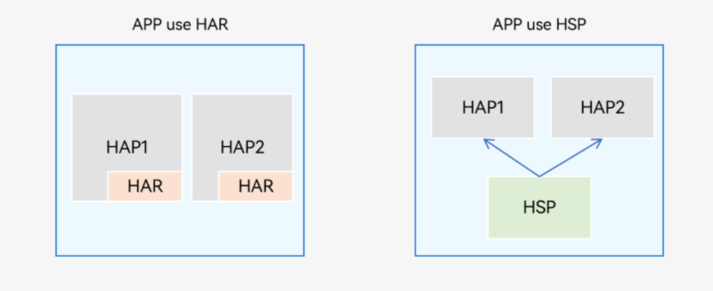

## 应用程序包（HAP、HAR、HSP）

HarmonyOS 的核心理念之一是 _一次开发，多端部署_

1. HAP（Harmony Ability Package）是应用安装和运行的基本单元。HAP 包是由代码、资源、第三方库、配置文件等打包生成的模块包，其主要分为两种类型：entry 和 feature

   - entry：应用的主模块，作为应用的入口，提供了应用的基础功能
   - feature：应用的动态特性模块，作为应用能力的扩展，可以根据用户的需求和设备类型进行选择性安装
   - 应用程序包可以只包含一个基础的 entry 包，也可以包含一个基础的 entry 包和多个功能性的 feature 包
   - 开发
     - 支持添加 UIAbility 组件或 ExtensionAbility 组件，添加 pages 页面
     - 支持引用 HAR 或 HSP 共享包
   - 使用场景
     - 单 HAP 场景：如果只包含 UIAbility 组件，无需使用 ExtensionAbility 组件，优先采用单 HAP（即一个 entry 包）来实现应用开发。虽然一个 HAP 中可以包含一个或多个 UIAbility 组件，为了避免不必要的资源加载，推荐采用“一个 UIAbility+多个页面”的方式。
     - 多 HAP 场景：如果应用的功能比较复杂，需要使用 ExtensionAbility 组件，可以采用多 HAP（即一个 entry 包+多个 feature 包）来实现应用开发，每个 HAP 中包含一个 UIAbility 组件或者一个 ExtensionAbility 组件。在这种场景下，可能会存在多个 HAP 引用相同的库文件，导致重复打包的问题。
       
     * 多 HAP 打包视图
       
   - 约束限制
     - 不支持导出接口和 ArkUI 组件，给其他模块使用
     - 多 HAP 场景下，App Pack 包中同一设备类型的所有 HAP 中必须有且只有一个 Entry 类型的 HAP，Feature 类型的 HAP 可以有一个或者多个，也可以没有
     - 多 HAP 场景下，同一应用中的所有 HAP 的配置文件中的 bundleName、versionCode、versionName、minCompatibleVersionCode、debug、minAPIVersion、targetAPIVersion、apiReleaseType 相同，同一设备类型的所有 HAP 对应的 moduleName 标签必须唯一。HAP 打包生成 App Pack 包时，会对上述参数配置进行校验
     - 多 HAP 场景下，同一应用的所有 HAP、HSP 的签名证书要保持一致。上架应用市场是以 App Pack 形式上架，应用市场分发时会将所有 HAP 从 App Pack 中拆分出来，同时对其中的所有 HAP 进行重签名，这样保证了所有 HAP 签名证书的一致性。在调试阶段，开发者通过命令行或 DevEco Studio 将 HAP 安装到设备上时，要保证所有 HAP 签名证书一致，否则会出现安装失败的问题

2. HAR（Harmong Archive）静态共享包，可以包含代码、C++库、资源和配置文件。通过 HAR 可以实现多个模块或多个工程共享 ArkUI 组件、资源等相关代码。

   - 开发

     - 配置 HAR 导出声明文件的入口：oh-package.json5 中 main 字段 `{"main": "Index.ets"}`
     - 导出 ArkUI 组件，与 ts 的导出方式一致，通过 export 导出
       ```
          export { MainPage } from "./src/main/ets/components/mainpage/MainPage"
       ```
     - 导出 ts 类和方法，支持通过 export 导出多个 ts 类和方法
       ```
         export { Log } from './src/main/ts/test';
         export { func } from './src/main/ts/test';
         export { func2 } from './src/main/ts/test';
       ```
     - 导出 native 方法，在 HAR 中可以包含 C++编写的 so

       ```
         import native from 'liblibrary.so';

         export function nativeAdd(a: number, b: number): number {
           let result: number = native.add(a, b);
           return result;
         }
       ```

     - 资源
       - 优先级
         - AppScope（仅 API9 的 Stage 模型支持）
         - HAP 包自身模块
         - 依赖的 HAR 模块，如果依赖的多个 HAR 之间有资源冲突，会按照工程 oh-package.json5 中 dependencies 下的依赖顺序进行覆盖，依赖顺序在前的优先级较高
       - 使用，通过`$r`应用 HAR 中的资源

   - 使用场景

     - 作为二方库，发布到 OHPM 私仓，供公司内部其他应用使用
     - 作为三方库，发布到 OHPM 中心仓，供其他应用使用

   - 约束限制

     - HAR 不支持在设备上单独安装/运行，只能作为应用模块的依赖项被引用。
     - HAR 不支持在配置文件中声明 UIAbility 组件与 ExtensionAbility 组件。
     - HAR 不支持在配置文件中声明 pages 页面，但是可以包含 pages 页面，并通过命名路由的方式进行跳转。
     - HAR 不支持引用 AppScope 目录中的资源。在编译构建时，AppScope 中的内容不会打包到 HAR 中，因此会导致 HAR 资源引用失败。
     - HAR 可以依赖其他 HAR，但不支持循环依赖，也不支持依赖传递。

   - 普通跨包路由

     1. 在 HAR 的 ets->components 下新增 PageOne.ets：
        ```
          @Entry
          @Component
          export struct PageOne {
            pathStack: NavPathStack = new NavPathStack();
            build() {
              NavDestination(){
                Column(){
                  Text("PageOne")
                }
              }
              .title("PageOne")
              .onReady((context: NavDestinationContext) => {
                  this.pathStack = context.pathStack;
                  let params = this.pathStack.getParamByName("PageOne") as string[]
              })
            }
          }
        ```
     2. 在 HAR 统一的导出文件 Index.ets 中导出组件
        ```
          export { PageOne } from "./src/main/ets/components/PageOne"
        ```
     3. 在 HAP 导入静态包依赖
        - entry 中 oh-package.json5 中配置 HAR 路径，并使用使用`ohpm install`同步
          ```
            {
              "dependencies": {
                "common": "../common"
              }
            }
          ```
        - 在 entry 中直接使用`ohpm install path/to/foo`安装 HAR
     4. 在 HAP 中的页面中使用 HAR 页面组件

        ```
          import { PageOne } from "common"
          @Entry
          @Component
          struct Index {
            pathStack: NavPathStack = new NavPathStack();
            @Builder
            pageMap(name: string, params?: string){
              if(name === "PageOne"){
                PageOne()
              }
            }
            build() {
              Column() {
                Navigation(this.pathStack){
                  Text("跳转PageOne")
                    .onClick(() => {
                      this.pathStack.pushPathByName("PageOne", JSON.stringify({a: 1}), true)
                    })
                }
                .navDestination(this.pageMap)
              }
            }
          }
        ```

   - 命名跨包路由

     1. 在 HAR 的 ets->components 下新增 PageOne.ets：
        ```
          import { router } frm "@ohos.router"
          @Entry({ routeName: "PageOne" })
          @Component
          export struct PageOne {
            build() {
              Column(){
                Text("PageOne")
                .onClick(() => {
                  console.log("PageOne", JSON.stringify(router.getParams()))
                })
              }
            }
          }
        ```
     2. 在 HAR 统一的导出文件 Index.ets 中导出组件
        ```
          export { PageOne } from "./src/main/ets/components/PageOne"
        ```
     3. 在 HAP 中导入 HAR 静态包依赖
     4. 在 HAP 中的页面中使用 HAR 页面组件

        ```
          import { router } from "@ohos.router"
          import("common")

          @Entry
          @Component
          struct Index {
            build() {
              Button("跳转PageOne")
              .onClick(() => {
                router.pushNamedRoute({
                  name: "PageOne",
                  params: {
                    a: 1,
                  }
                })
              })
            }
          }

        ```

3. HSP（Harmony Shared Package）动态共享包，可以包含代码、C++库、资源和配置文件，通过 HSP 可以实现代码合资源的共享。HSP 不支持独立发布，而是跟随其宿主应用的 APP 包一起发布，与宿主应用同进程，具有相同的包名和生命周期
   - HAR 与 HSP 之间引用区别
     
   - 开发与 HAR 一致
   - 使用场景
     - 多个 HAP/HSP 共用的代码和资源放在同一个 HSP 中，可以提高代码、资源的可重用性和可维护性，同时编译打包时也只保留一份 HSP 代码和资源，能够有效控制应用包大小
     - HSP 在运行时按需加载，有助于提升应用性能
     - 同一个组织内部的多个应用之间，可以使用集成态 HSP 实现代码和资源的共享。
   - 约束限制
     - HSP 不支持在设备上单独安装/运行，需要与依赖该 HSP 的 HAP 一起安装/运行。HSP 的版本号必须与 HAP 版本号一致
     - HSP 不支持在配置文件中声明 UIAbility 组件与 ExtensionAbility 组件
     - HSP 可以依赖其他 HAR 或 HSP，但不支持循环依赖，也不支持依赖传递
     - 集成态 HSP 只支持 Stage 模型
     - 集成态 HSP 需要 API12 及以上版本，使用标准化的 OHMUrl 格式。
   - 跨包路由
     1. 在 HSR 的 ets->pages 下新增 `PageOne.ets`：
        ```
          import { router } from "@ohos.router"
          @Entry
          @Component
          export struct PageOne {
            build() {
              Column(){
                Text("PageOne")
                Button("返回")
                .onClick(() => {
                  router.back({ url: "pages/Index" })
                })
              }
            }
          }
        ```
     2. 在 HAP 中 entry 的 pages 下新建 `Index.ets`：
        ```
          import { router } from "@ohos.router"
          @Entry
          @Component
          struct Index {
            build() {
              Column(){
                Button("跳转PageOne")
                .onClick(() => {
                  router.pushUrl({
                    url: "@bundle:com.example.entry/common/PageOne"
                  })
                })
              }
            }
          }
        ```
     3. 跳转路径 `@bundle:包名/模块名/路径/文件名`，包名在 AppScope 下 `app.json5` 中的 bundleName
   - 集成态 HSP
     - 集成态 HSP 是应用内 HSP 的一种中间编译产物，目的就是解决使用方的 bundleName 和签名强耦合性
     - HSP 只能给 bundleName 一样的项目使用，集成态 HSP 可以给不同的 bundleName 的工程集成使用
     - 创建方：
       - 需要使用标准化的 HOMUrl 格式，修改工程级构建配置文件 `build-profile.json5`，设置配置项 useNormalizedOHMUrl 为 true
         ```
           {
             "app": {
               "buildOption": {
                 "strictMode": {
                   "useNormalizedOHMUrl": true
                 }
               }
             }
           }
         ```
       - 修改模块级构建配置文件 `build-profile.json5`，设置配置项 integratedHsp 为 true，指定构建的 HSP 模块为集成态 HSP
         ```
           {
             "buildOption": {
               "arkOptions": {
                 "integratedHsp": true
               }
             }
           }
         ```
       - 打包配置（tgz 包）
         - 配置项目签名信息
         - 配置 release 模块
         - 选择对应 HSP 模块，构建
     - 使用方
       - 工程依赖配置：主模块下`oh-package.json5`配置文件中添加依赖
         ```
           {
             "dependencies": {
               "hsp": "./lib/library-default.tgz"
             }
           }
         ```
       - 工程配置：修改工程级配置文件 `build-profile.json5`，设置配置项 useNormalizedOHMUrl 为 true
         ```
           {
             "buildOption": {
               "strictMode": {
                 "useNormalizedOHMUrl": true
               }
             }
           }
         ```
