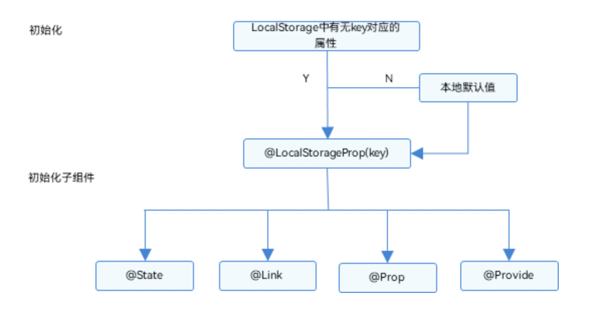
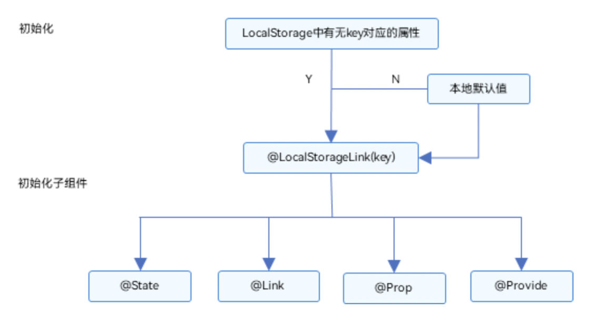
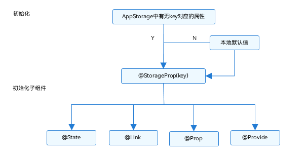
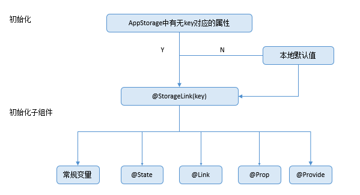
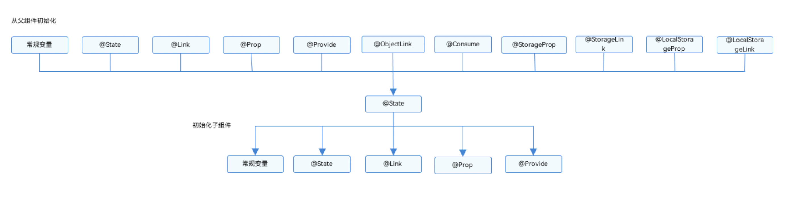
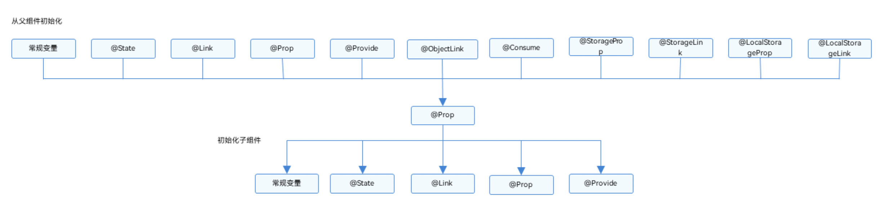
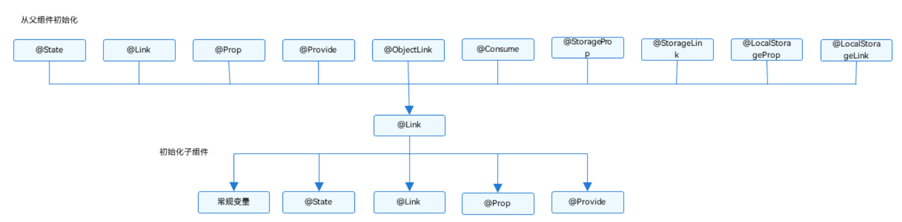
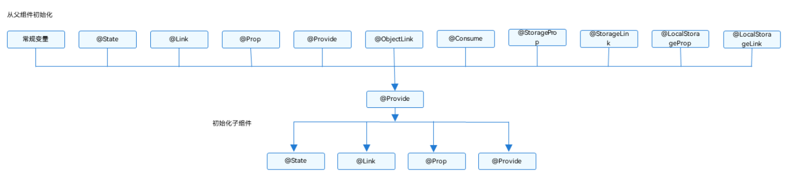
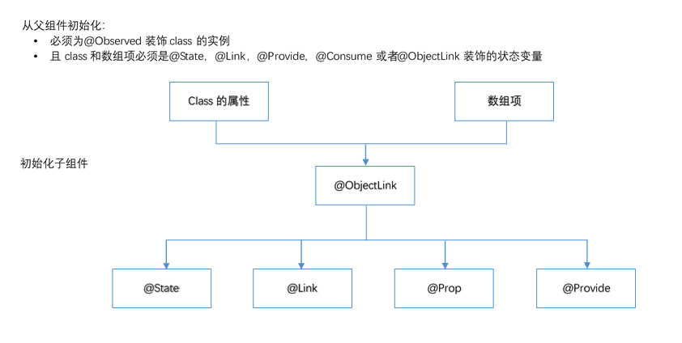

## 状态管理

1. 应用级状态管理

   - LocalStorage 页面级 UI 状态存储

     - LocalStorage 是页面级的 UI 状态存储，通过`@Entry` 装饰器接收的参数可以在页面内共享同一个 LocalStorage 实例。LocalStorage 支持 UIAbility 实例内多个页面间状态共享
     - 是 ArkTS 为构建页面级别状态变量提供存储的内存内“数据库”,页面级 UI 状态存储，通常用于 UIAbility 内、页面间的状态共享
     - 应用程序可以创建多个 LocalStorage 实例，LocalStorage 实例可以在页面内共享，也可以通过 GetShared 接口，实现跨页面、UIAbility 实例内共享
     - 组件树的根节点，即被`@Entry` 装饰的`@Component`，可以被分配一个 LocalStorage 实例，此组件的所有子组件实例将自动获得对该 LocalStorage 实例的访问权限
     - 被`@Component`装饰的组件最多可以访问一个 LocalStorage 实例和 AppStorage，未被`@Entry` 装饰的组件不可被独立分配 LocalStorage 实例，只能接受父组件通过`@Entry` 传递来的 LocalStorage 实例。一个 LocalStorage 实例在组件树上可以被分配给多个组件
     - LocalStorage 中的所有属性都是可变的
     - 应用程序决定 LocalStorage 对象的生命周期。当应用释放最后一个指向 LocalStorage 的引用时，比如销毁最后一个自定义组件，LocalStorage 将被 JS Engine 垃圾回收
     - 装饰器
       - `@LocalStorageProp`：装饰的变量与 LocalStorage 中给定属性建立单向同步关系
         
         - 被`@LocalStorageProp` 装饰的变量的值的变化不会同步回 LocalStorage 里
         - `@LocalStorageProp` 装饰的变量变化会使当前自定义组件中关联的组件刷新
         - `LocalStorage(key)`中值的变化会引发所有被`@LocalStorageProp` 对应 key 装饰的变量的变化，会覆盖`@LocalStorageProp` 本地的改变
       - `@LocalStorageLink`：装饰的变量与 LocalStorage 中给定属性建立双向同步关系
         
         - 当`@LocalStorageLink(key)`装饰的数值改变被观察到时，修改将被同步回 LocalStorage 对应属性键值 key 的属性中
         - LocalStorage 中属性键值 key 对应的数据一旦改变，属性键值 key 绑定的所有的数据（包括双向`@LocalStorageLink`和单向`@LocalStorageProp`）都将同步修改
         - 当`@LocalStorageLink(key)`装饰的数据本身是状态变量，它的改变不仅仅会同步回 LocalStorage 中，还会引起所属的自定义组件的重新渲染
     - 示例

       - 应用方面使用 storage 方式
         ```
           const storage = new LocalStorage({
             name: "哈哈"
           })
           storage.set("name", "呵呵")
         ```
       - UI 内部使用 LocalStorage：使用`@LocalStorageLink`和`@LocalStorageProp`

         ```
           let storage = new LocalStorage({
            name: "Tom",
            age: 20,
           })

           @Entry(storage)
           @Component
           struct Index {
            @LocalStorageProp("name") name: string = ""
            @LocalStorageLink("age") age: number = 0
            build() {
              Column() {
                Text("姓名："+this.name)
                Text("年龄："+this.age)
                Button("年龄加1")
                  .onClick(() => {
                    this.age++
                  })
              }
            }
           }
         ```

       - 将 LocalStorage 实例从 UIAbility 共享到一个或多个视图

         - `EntryAbility.ts` 中

           ```
             export default class EntryAbility extends Ability {
               storage = new LocalStorage({
                 name: "Tom",
                 age: 20,
               })

               onWindowStageCreate(windowStage: WindowStage) {
                windowStage.loadContent("pages/Index", this.storage, (err, data) => {
                  if(err.code){
                    console.error(err)
                    return
                  }
                })
               }
             }
           ```

         - `Index.ets` 主页面
           ```
            let storage = LocalStorage.GetShared()
            @Entry(storage)
            @Component
            struct Index {
              @LocalStorageProp("name") name: string = ""
              @LocalStorageLink("age") age: number = 0
              build() {
                Column() {
                  Text("姓名："+this.name)
                  Text("年龄："+this.age)
                  Button("年龄加1")
                    .onClick(() => {
                      this.age++
                    })
                }
              }
            }
           ```

   - AppStorage 应用全局的 UI 状态存储

     - AppStorage 是应用全局的 UI 状态存储，是和应用的进程绑定的，由 UI 框架在应用程序启动时创建，为应用程序 UI 状态属性提供中央存储
     - 相当于整个应用的“中枢”，持久化数据 PersistentStorage 和环境变量 Environment 都是通过 AppStorage 中转，才可以和 UI 交互
     - AppStorage 是在应用启动的时候会被创建的单例。AppStorage 将在应用运行过程保留其属性。属性通过唯一的键字符串值访问
     - AppStorage 可以和 UI 组件同步，且可以在应用业务逻辑中被访问
     - AppStorage 支持应用的主线程内多个 UIAbility 实例间的状态共享
     - AppStorage 中的属性可以被双向同步，数据可以是存在于本地或远程设备上，并具有不同的功能，比如数据持久化（详见 PersistentStorage）。这些数据是通过业务逻辑中实现，与 UI 解耦，如果希望这些数据在 UI 中使用，需要用到`@StorageProp` 和`@StorageLink`
     - 装饰器
       - `@StorageProp`：装饰的变量与 AppStorage 中给定属性建立单向同步关系
         
         - 当`@StorageProp(key)`装饰的数值改变被观察到时，修改不会被同步回 AppStorage 对应 key 的属性中
         - 当前`@StorageProp(key)`单向绑定的数据会被修改，即仅限于当前组件的私有成员变量改变，其他绑定该 key 的数据不会同步改变
         - 当`@StorageProp(key)`装饰的数据本身是状态变量，它的改变虽然不会同步回 AppStorage 中，但是会引起所属的自定义组件重新渲染
         - 当 AppStorage 中 key 对应的属性发生改变时，会同步给所有`@StorageProp(key)`装饰的数据，`@StorageProp(key)`本地的修改将被覆盖。
       - `@StorageLink`：装饰的变量与 AppStorage 中给定属性建立双向同步关系
         
         - 当`@StorageLink(key)`装饰的数值改变被观察到时，修改将被同步回 AppStorage 对应属性键值 key 的属性中
         - AppStorage 中属性键值 key 对应的数据一旦改变，属性键值 key 绑定的所有的数据（包括双向`@StorageLink` 和单向`@StorageProp`）都将同步修改
         - 当`@StorageLink(key)`装饰的数据本身是状态变量，它的改变不仅仅会同步回 AppStorage 中，还会引起所属的自定义组件的重新渲染。
     - 示例
       - 应用逻辑使用 AppStorage
         ```
           AppStorage.SetOrCreate("name", "Tom")
           let name = AppStorage.Get("name")
           let link1 = AppStorage.Link("name")
           let prop1 = AppStorage.Prop("name")
         ```
       - UI 内部使用 AppStorage
         ```
           AppStorage.SetOrCreate("name", "Tom")
           AppStorage.SetOrCreate("age", 20)
           @Entry
           @Component
           struct Index {
             @StorageProp("name") name: string = ""
             @StorageLink("age") age: number = 0
             build() {
                Column() {
                 Text("姓名："+this.name)
                 Text("年龄："+this.age)
                 Button("年龄加1")
                   .onClick(() => {
                     this.age++
                   })
               }
             }
           }
         ```

   - PersistentStorage 持久化存储 UI 状态

     - PersistentStorage 是应用程序中的可选单例对象。此对象的作用是持久化存储选定的 AppStorage 属性，以确保这些属性在应用程序重新启动时的值与应用程序关闭时的值相同
     - UI 和业务逻辑不直接访问 PersistentStorage 中的属性，所有属性访问都是对 AppStorage 的访问，AppStorage 中的更改会自动同步到 PersistentStorage
     - PersistentStorage 和 AppStorage 中的属性建立双向同步。应用开发通常通过 AppStorage 访问 PersistentStorage，另外还有一些接口可以用于管理持久化属性，但是业务逻辑始终是通过 AppStorage 获取和设置属性的
     - 不允许的类型和值
       - 不支持嵌套对象（对象数组，对象的属性是对象等）。因为目前框架无法检测 AppStorage 中嵌套对象（包括数组）值的变化，所以无法写回到 PersistentStorage 中
     - PersistentStorage 的持久化变量最好是小于 2kb 的数据，不要大量的数据持久化，因为 PersistentStorage 写入磁盘的操作是同步的，大量的数据本地化读写会同步在 UI 线程中执行，影响 UI 渲染性能。如果开发者需要存储大量的数据，建议使用数据库 api
     - PersistentStorage 和 UI 实例相关联，持久化操作需要在 UI 实例初始化成功后（即 loadContent 传入的回调被调用时）才可以被调用，早于该时机调用会导致持久化失败
       ```
         onWindowStageCreate(windowStage: window.WindowStage){
           windowStage.loadContent("pages/Index", (err) => {
             if(err.code){
               return
             }
             PersistentStorage.PersistProp("name", "Tom")
           })
         }
       ```
     - PersistentStorage 只能在 UI 页面内使用，否则将无法持久化数据
     - 示例
       - 初始化 PersistentStorage
         ```
           PersistentStorage.PersistProp("name", "Tom")
           AppStorage.Get("name")
         ```
       - 在 UI 中使用参考 AppStorage 示例

   - Preferences 用户首选项
     - 用于保存应用的配置信息
     - 数据通过文本的形式保存在设备中，应用使用过程中会将文本中的数据全量加载到内存中，所以访问速度快、效率高，但不适合需要存储大量数据的场景
     - 用户首选项为应用提供 Key-Value 键值型的数据处理能力。
       - Key 键为 string 类型，要求非空且长度不超过 _80 个字节_
       - 如果 Value 值为 string 类型，请使用 UTF-8 编码格式，可以为空，不为空时长度不超过 _8192 个字节_

2. UI 组件状态管理

   - 父子单向通信 无响应式

     - 无响应式，无法因为父组件数据的改变，子组件改变
     - 可以设置默认值
     - 可以更改，但是会覆盖父级传来的数据
     - 示例

       ```
         @Component
         struct ChildA {
           count: number
           callback: (n: number) => void
           build() {
             Column() {
               Text("count:"+this.count)
               Button("add")
                 .onClick(() => {
                   this.callback()
                 })
             }
           }
         }

         @Entry
         @Component
         struct Index {
           @State count: number = 0
           build() {
             Column() {
               ChildA({count: this.count, callback: (n) => this.count ++ })
               Button("add")
                 .onClick(() => {
                   this.count++
                 })
             }
           }
         }
       ```

   - `@Stage` 组件内状态
     - `@Stage`装饰的变量，或称为状态变量，一旦变量拥有了状态属性，就可以触发其直接绑定 UI 组件的刷新。当状态改变时，UI 会发生对应的渲染改变
     - `@State`装饰的变量，与声明式范式中的其他被装饰变量一样，是私有的，只能从组件内部访问，在声明时必须指定其类型和本地初始化。初始化也可选择使用命名参数机制从父组件完成初始化
     - 当状态变量被改变时，查询依赖该状态变量的组件
     - 执行依赖该状态变量的组件的更新方法，组件更新渲染
     - 和该状态变量不相关的组件或者 UI 描述不会发生重新渲染，从而实现页面渲染的按需更新。
     - 初始化规则
       
     - 示例
       ```
         @Component
         struct Demo {
           @Stage name: string = "Tom"
           build() {
             Text("Hello "+this.name)
             TextInput({text: this.name})
               .onChange((value) => {
                 this.name = value
               })
           }
         }
       ```
   - `@Prop` 父子单向同步

     - `@Prop` 装饰的变量可以和父组件建立单向的同步关系。`@Prop` 装饰的变量是可变的，但是变化不会同步回其父组件
     - `@Prop` 装饰的数据更新依赖其所属自定义组件的重新渲染，所以在应用进入后台后，`@Prop` 无法刷新，推荐使用`@Link` 代替。
     - 初始化规则
       
     - 示例

       ```
         @Component
         struct Child {
          @Prop count: number
          callback: (n: number) => void
          build() {
            Column() {
              Text("count:"+this.count)
              Button("add")
                .onClick(() => {
                  this.callback(this.count)
                })
            }
          }
         }

         @Entry
         @Component
         struct Index {
          @State count: number = 0
          build() {
            Column() {
              Child({count: this.count, callback: (n) => this.count = n })
              Button("add")
                .onClick(() => {
                  this.count++
                })
            }
          }
         }
       ```

   - `@Link` 父子双向同步

     - 子组件中被`@Link`装饰的变量与其父组件中对应的数据源建立双向数据绑定
     - `@Link`装饰的变量与其父组件中的数据源共享相同的值
     - `@Link` 装饰器不能在`@Entry` 装饰的自定义组件中使用，只能用于子组件
     - 子组件`@Link` 包装类把当前 this 指针注册给父组件。父组件`@State` 变量变更后，会遍历更新所有依赖它的系统组件（elementid）和状态变量（比如`@Link` 包装类）
     - `@Link`更新后，调用父组件的`@State`包装类的 set 方法，将更新后的数值同步回父组件
     - 子组件`@Link`和父组件`@State`分别遍历依赖的系统组件，进行对应的 UI 的更新。以此实现子组件`@Link`同步回父组件`@State`
     - 初始化规则
       
     - 示例

       ```
         @Entry
         @Component
         struct Index {
           @State count: number = 0
           build() {
             Column() {
               Child({count: this.count})
               Button("add")
                 .onClick(() => {
                   this.count++
                 })
              }
           }
         }

         @Component
         struct Child {
          @Link count: number
          build() {
            Column() {
              Text("count:"+this.count)
              Button("add")
                .onClick(() => {
                  this.count++
                })
            }
          }
         }
       ```

   - `@Provide` 和 `@Consume` 与后代组件双向同步

     - `@Provide`装饰的变量是在祖先组件中，可以理解为被“提供”给后代的状态变量
     - `@Consume`装饰的变量是在后代组件中，去“消费（绑定）”祖先组件提供的变量
     - `@Provide`和`@Consume`摆脱参数传递机制的束缚，实现跨层级传递
     - `@Provide` 和`@Consume` 通过相同的变量名或者相同的变量别名绑定时，`@Provide` 装饰的变量和`@Consume` 装饰的变量是一对多的关系
     - 不允许在同一个自定义组件内，包括其子组件中声明多个同名或者同别名的`@Provide`装饰的变量，`@Provide` 的属性名或别名需要唯一且确定，如果声明多个同名或者同别名的`@Provide` 装饰的变量，会发生运行时报错
     - 初始化规则
       
     - 示例

       ```
         @Entry
         @Component
         struct Index {
           @Provide count: number = 0
           build() {
             Column() {
               Child()
             }
           }
         }

         @Component
         struct Child {
          @Consume count: number
          build() {
            Column() {
              Text("count:"+this.count)
              Button("add")
                .onClick(() => {
                  this.count++
                })
            }
          }
         }
       ```

   - `@Observed` 和`@ObjectLink` 嵌套类对象属性变化

     - 用于在涉及嵌套对象或数组的场景中进行双向数据同步
     - 被`@Observed` 装饰的类，可以被观察到属性的变化
     - 子组件中`@ObjectLink`装饰器装饰的状态变量用于接收`@Observed` 装饰的类的实例，和父组件中对应的状态变量建立双向数据绑定。这个实例可以是数组中的被`@Observed` 装饰的项，或者是 class
     - object 中的属性，这个属性同样也需要被`@Observed` 装饰
     - 单独使用`@Observed`是没有任何作用的，需要搭配`@ObjectLink`或者`@Prop`使用
     - 使用`@Observed` 装饰 class 会改变 class 原始的原型链，`@Observed` 和其他类装饰器装饰同一个 class 可能会带来问题
     - `@ObjectLink`装饰器不能在@Entry 装饰的自定义组件中使用
     - 初始化规则
       
     - 示例

       ```
          @Observed
          class DataA {
            public count: number
            constructor(c: number) {
              this.count = c
            }
          }
          @Observed
          class DataB {
            public dataA: DataA
            public count: number
            constructor(d: DataA, c: number) {
              this.dataA = d
              this.count = c
            }
          }

          @Entry
          @Component
          struct Index {
            @State dataB: DataB = new DataB(new DataA(0), 1)
            build() {
              Column() {
                Child({dataB: this.dataB})
              }
            }
          }

          @Component
          struct Child {
            @ObjectLink dataB: DataB
            build() {
              Column() {
                Text("count:" + this.dataB.dataA.count)
                Button("add")
                  .onClick(() => {
                    this.dataB.dataA.count++
                  })
              }
            }
          }
       ```

   - `@Watch` 状态变量更改通知

     - 用于监听状态变量的变化，当状态变量变化时，`@Watch` 的回调方法将被调用
     - `@Watch`在 ArkUI 框架内部判断数值有无更新使用的是严格相等（===），遵循严格相等规范。当在严格相等为 false 的情况下，就会触发`@Watch` 的回调
     - `@Watch` 必须在前面有修饰符使用，例如`@State` 或者 `@Prop`，但是像`@Link` 等不能在这里使用，因为这是双向绑定的
     - 当观察到状态变量的变化（包括双向绑定的 AppStorage 和 LocalStorage 中对应的 key 发生的变化）的时候，对应的`@Watch`的回调方法将被触发
     - `@Watch` 方法在自定义组件的属性变更之后同步执行
     - 如果在`@Watch` 的方法里改变了其他的状态变量，也会引起状态变更和`@Watch` 的执行
     - 在第一次初始化的时候，`@Watch` 装饰的方法不会被调用，即认为初始化不是状态变量的改变。只有在后续状态改变时，才会调用`@Watch` 回调方法
     - 不建议在`@Watch` 函数中调用 `async await`，因为`@Watch` 设计的用途是为了快速的计算，异步行为可能会导致重新渲染速度的性能问题
     - 示例

       ```
        @Entry
        @Component
        struct Index {
          @State count: number = 0
          build() {
            Column() {
              Child({count: this.count})
              Button("add").onClick(() => {
                this.count++
              })
            }
          }
        }

        @Component
        struct Child {
          @Prop @Watch("watchCountChange") count: number

          watchCountChange(key: string) {
            console.info("watchCountChange:" + key, this.count)
          }
          build() {
            Column() {
              Text("count:" + this.count)
            }
          }
        }
       ```
