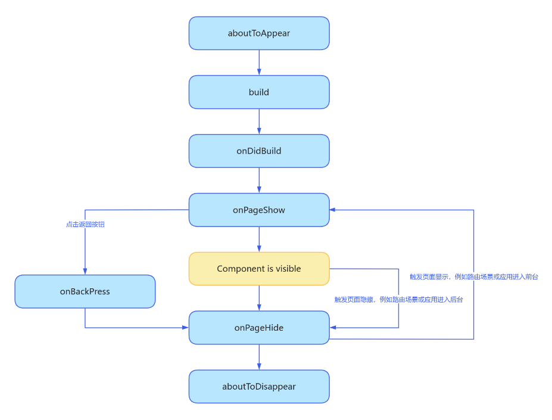

## 生命周期

1. UIAbility

   - 状态图

     

   - 周期函数

     - `onCreate(want: Want)`：在 UIAbility 实例创建完成时触发
     - UIAbility 实例创建完成后，在进入 Foreground 之前，系统会创建一个 WindowStage（具体生命周期参考 2）
       
     - `onForeground()`，在 UIAbility 的 UI 可见之前，如 UIAbility 切换至前台时触发。可以在 `onForeground()`回调中申请系统需要的资源，或者重新申请在 `onBackground()`中释放的资源
     - `onBackground()`，在 UIAbility 的 UI 完全不可见之后，如 UIAbility 切换至后台时候触发。可以在 `onBackground()`回调中释放 UI 不可见时无用的资源，或者在此回调中执行较为耗时的操作，例如状态保存等
     - `onDestroy()`，UIAbility 实例销毁时触发。在回调中进行系统资源的释放、数据的保存等操作

   - 回调函数
     - `onNewWant()`，当应用的 UIAbility 实例已创建，且 UIAbility 配置为 singleton 启动模式时，再次调用 `startAbility()`方法启动该 UIAbility 实例时触发。可以在该回调中更新要加载的资源和数据等，用于后续的 UI 展示

2. WindowStage

   - 状态图

     

   - 周期函数
     - `onWindoStageCreate(windowStage: window.WindowStage)`，WindowStage 创建完成之后会进入 `onWindoStageCreate()`回调，可以在该回调中设置 UI 加载、设置 WindowStage 的事件订阅
       - 通过`windowStage.loadContent`设置应用要加载的页面
       - 通过`windowStage.on('windowStageEvent')`方法订阅 WindowStage 的事件（获焦/失焦、可见/不可见）
     - `onWindowStageDestroy()`，UIAbility 实例销毁之前触发的事件回调，可以在回调中释放 UI 资源
     - `onWindowStageWillDestroy()`，在 WindowStage 销毁前执行，此时 WindowStage 可以使用

3. AbilityStage

   - 状态图

     

   - 周期函数
     - `onCreate()`，当应用创建时调用
     - `onDestroy()`，当应用销毁时调用, 此方法将在正常的调度生命周期中调用, 当应用程序异常退出或被终止时，将不会调用此方法。
   - 回调函数
     - `onAcceptWant(want: Want): string`，启动一个 specified ability 时触发的事件
     - `onNewProcessRequest(want: Want): string`，在指定进程中启动 UIAbility 时回调
     - `onConfigurationUpdate(newConfig: Configuration)`，环境变化通知接口，发生全局配置变更时回调
     - `onMemoryLevel(level: AbilityConstant.MemoryLevel)`，当系统已决定调整内存时调用

4. 页面和自定义组件生命周期

   - 自定义组件：`@Component` 装饰的 UI 单元，可以组合多个系统组件实现 UI 的复用，可以调用组件的生命周期

     - aboutToAppear：组件即将出现时回调该接口，具体时机为在创建自定义组件的新实例后，在执行其 `build()`函数之前执行
     - onDidBuild：组件 `build()`函数执行完成之后回调该接口，不建议在 onDidBuild 函数中更改状态变量、使用 animateTo 等功能，这可能会导致不稳定的 UI 表现
     - aboutToDisappear：aboutToDisappear 函数在自定义组件析构销毁之前执行。不允许在 aboutToDisappear 函数中改变状态变量，特别是`@Link` 变量的修改可能会导致应用程序行为不稳定

   - 页面：可以由一个或者多个自定义组件组成，`@Entry` 装饰的自定义组件为页面的入口组件，即页面的根节点，一个页面有且仅能有一个`@Entry`。只有被`@Entry` 装饰的组件才可以调用页面的生命周期

     - onPageShow：页面每次显示时触发一次，包括路由过程、应用进入前台等场景
     - onPageHide：页面每次隐藏时触发一次，包括路由过程、应用进入后台等场景
     - onBackPress：当用户点击返回按钮时触发

   - 状态图

     

   - 自定义组件监听页面生命周期，使用无感监听页面路由的能力
     ```
        @Component
        struct MyComponent {
          listener: (info: uiObserver.RouterPageInfo) => void = (info: uiObserver.RouterPageInfo) => {
            let routerInfo: uiObserver.RouterPageInfo | undefined = this.queryRouterPageInfo()
            if (info.pageId == routerInfo?.pageId) {
              if(info.state == uiObserver.RouterPageState.ON_PAHE_SHOW) {
                console.log('onPageShow')
              }else if (info.state == uiObserver.RouterPageState.ON_PAHE_HIDE) {
                console.log('onPageHide')
              }
            }
          }
          aboutToAppear() {
            let uiObserver = this.getUIContext().getUIObserver()
            uiObserver.on("routerPageUpdate", this.listener)
          }
           aboutToDisappear() {
            let uiObserver = this.getUIContext().getUIObserver()
            uiObserver.off("routerPageUpdate", this.listener)
          }
          build() {
            Column() {
              Text("文本")
            }
          }
        }
     ```

5. 整体生命周期
   
